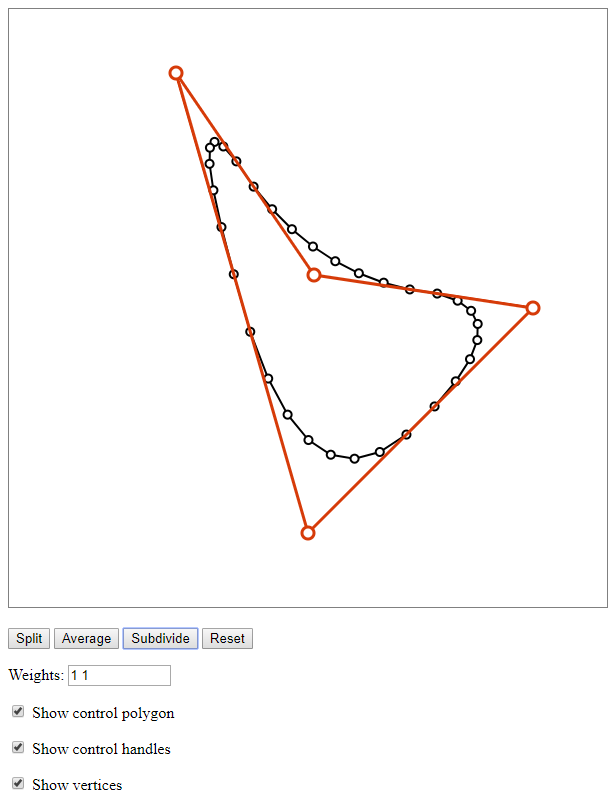

# Subdivision
Webpage with demonstration of interactive polygon subdivision. Based on an application from Tony DeRose at Pixar: [YouTube link](https://www.youtube.com/watch?v=mX0NB9IyYpU&t=3m46s). 

Developed for Professor Tim Chartier's [When Life is Linear](https://lifeislinear.davidson.edu/Subdivision.html) course.

